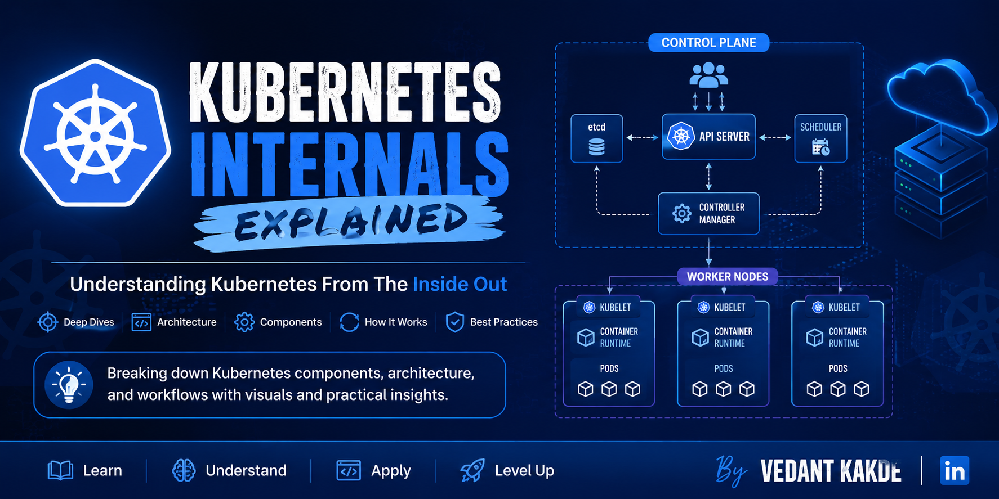

# ☸️ Kubernetes Internals Explained

> A complete collection of my **"Kubernetes Internals Explained"** LinkedIn series, bringing together every post, architecture diagram, and explanation in one place.

  
  
  
  

  

---

## 📖 About This Repository

Kubernetes is one of the most widely used container orchestration platforms, yet many engineers only interact with it through commands like `kubectl apply`, `kubectl get pods`, or Helm charts without understanding what actually happens behind the scenes.

This repository is my attempt to explain Kubernetes from the inside out.

Each post in this series breaks down a Kubernetes component, explains how it works internally, and illustrates how different components communicate with one another.

Whether you're preparing for interviews, working as a DevOps/Platform Engineer, or simply curious about Kubernetes internals, this repository aims to provide practical and easy-to-understand explanations.

---

# 📚 Series Index

| # | Topic | LinkedIn Post | Status |
|---|-------|---------------|--------|
| 01 | What Actually Happens When You Run `kubectl apply`? | 🔗 [Link](https://www.linkedin.com/posts/vedant-kakde_kubernetesinternalsexplained-kubernetes-devops-activity-7466484844777078784-aR5q) | ✅ Published |
| 02 | Kubernetes API Server Deep Dive | 🔗 [Link](https://www.linkedin.com/posts/vedant-kakde_kubernetesinternalsexplained-kubernetes-k8s-activity-7467092595148591104-3jI_) | ✅ Published |
| 03 | Understanding etcd: The Database Behind Kubernetes | 🔗 [Link](https://www.linkedin.com/posts/vedant-kakde_kubernetesinternalsexplained-kubernetes-k8s-activity-7467809831991549952-b0hz) | ✅ Published |
| 04 | Controller Manager Internals: The Self-Healing Engine of Kubernetes | 🔗 [Link](https://www.linkedin.com/posts/vedant-kakde_kubernetesinternalsexplained-kubernetes-k8s-activity-7469631823774498816-FLKK) | ✅ Published |
| 05 | Kubernetes Scheduler Internals: How Kubernetes Chooses the Right Node | 🔗 [Link](https://www.linkedin.com/posts/vedant-kakde_kubernetesinternalsexplained-kubernetes-k8s-activity-7471822316675481600-Q6Er) | ✅ Published |
| 06 | Kubelet Explained: The Node Agent That Brings Pods to Life | 🔗 [Link](https://www.linkedin.com/posts/vedant-kakde_kubernetesinternalsexplained-kubernetes-k8s-activity-7483544307438768128-Djoy) | ✅ Published |
| 07 | Container Runtime Interface (CRI): The Bridge Between Kubernetes and Container Runtimes | 🔗 [Link](https://www.linkedin.com/posts/vedant-kakde_kubernetesinternalsexplained-kubernetes-k8s-activity-7486477197193691136-Ac0S) | ✅ Published |

---

# 🎯 What You'll Learn

This series covers:

- Kubernetes Control Plane
- Kubernetes Worker Nodes
- API Server Architecture
- etcd Internals
- Controller Manager
- Scheduler
- Kubelet
- CRI
- Container Runtime
- Pod Lifecycle
- Networking
- Service Discovery
- Storage
- Controllers
- Reconciliation Loops
- Kubernetes API
- Admission Controllers
- Authentication & Authorization
- Resource Management
- Scheduling Decisions
- Production Best Practices

...and much more.

---

# 🚀 Why This Series?

Many Kubernetes resources explain **what** a component does.

This series focuses on **how it actually works internally**.

Instead of memorizing definitions, you'll understand:

- Why Kubernetes behaves the way it does
- How components communicate
- What happens after every API request
- How reconciliation loops work
- Why scheduling decisions are made
- How pods are actually created
- How failures are automatically recovered

---

# 🎓 Who Is This For?

- DevOps Engineers
- Platform Engineers
- Cloud Engineers
- Site Reliability Engineers (SRE)
- Kubernetes Beginners
- Experienced Kubernetes Users
- Students
- Interview Preparation
- CNCF Certification Aspirants (CKA, CKAD, CKS)

---

# ⭐ Stay Updated

This repository is continuously updated as new posts in the series are published.

If you find this helpful:

- ⭐ Star the repository
- 🍴 Fork it
- 📢 Share it with your network
- 💬 Open issues for suggestions or corrections

---

# 🤝 Connect With Me

If you enjoy this series, let's connect!

[Vedant Kakde](https://www.linkedin.com/in/vedant-kakde/)

- 💼 Senior DevOps Engineer
- ☁️ Cloud • Kubernetes • DevOps • Platform Engineering • AI Infrastructure

I regularly share content on:

- Kubernetes
- Docker
- DevOps
- Cloud (AWS • Azure • GCP)
- AI Infrastructure
- Platform Engineering
- Cost Optimization
- Production Learnings

---

## 📜 License

This repository is shared for educational purposes.

If you reuse any diagrams or content, please provide appropriate attribution.

---

## ⭐ If this repository helped you...

Please consider giving it a **Star** ⭐

It helps more engineers discover the series and motivates me to keep creating high-quality Kubernetes content.

Happy Learning! 🚀
